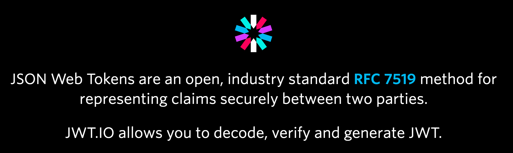

# [JSON Web Token (JWT)](https://tools.ietf.org/html/rfc7519) Get Started
JSON Web Token (JWT) is a compact, URL-safe means of representing claims to be transferred between two parties.




## Welcome
```
npm install
DEBUG=jwttest ava
```

## Do not store sensitive data in JWT
JWT can be parsed easily. Use [JSON Object Signing and Encryption](https://www.npmjs.com/package/node-jose) to secure data.

[Use JWT The Right Way!](https://stormpath.com/blog/jwt-the-right-way)

## LICENSE
MIT